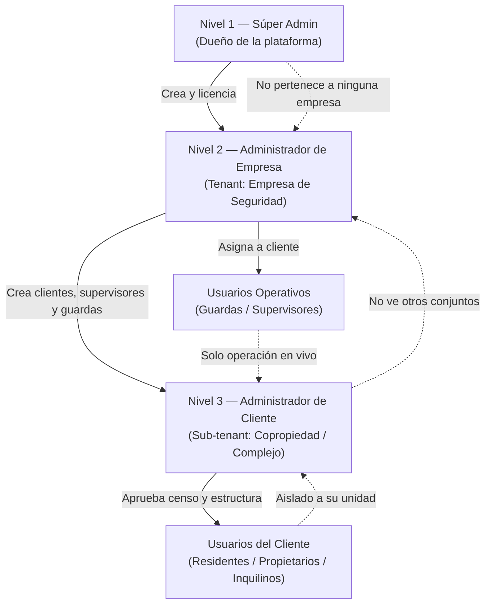
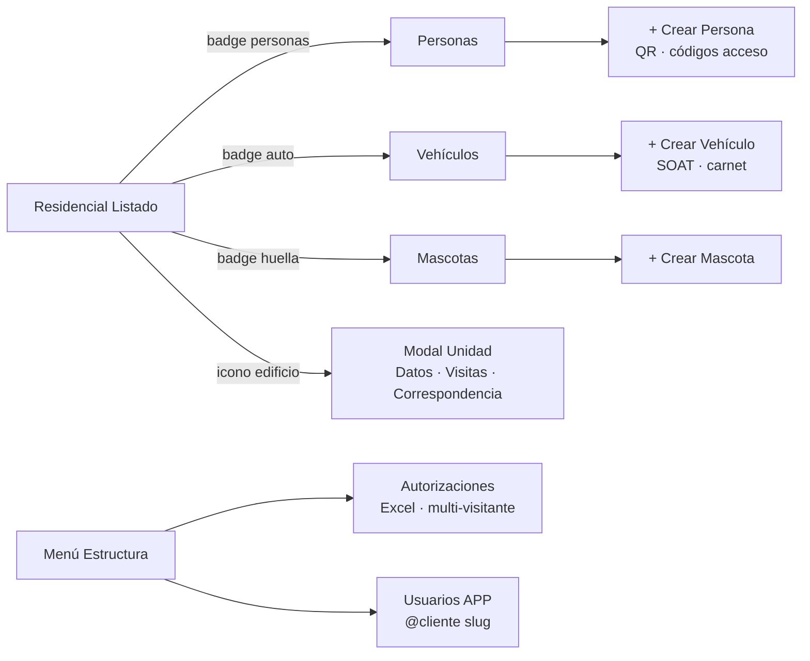

# Documento de Especificación Técnica y Arquitectura de Base de Datos (Referencia)

> **Propósito:** Documento vivo de ingeniería inversa del software de referencia de control de accesos.  
> Sirve como guía para alinear **Controla** sin modificar código hasta que se apruebe cada fase.  
> **Última actualización:** 2026-07-07  
> **Versión del documento:** 1.9  
> **Plan de implementación:** [PLAN-INICIO-PROYECTO-CONTROLA.md](./PLAN-INICIO-PROYECTO-CONTROLA.md) v1.0

---

## Metadatos del sistema de referencia

| Campo | Valor |
|-------|-------|
| **Nombre** | Plataforma Homóloga de Control de Accesos y Vigilancia Blindada |
| **Producto de referencia** | **Axesa Control** v13.0.0 — `axesacontrol.com` (operado por SJ Seguridad Privada – BigSky / Oktal) |
| **Core Framework** | Laravel 10 / PHP 8.2 |
| **Entorno** | Laragon |
| **Segmento** | Propiedad Horizontal (P.H.) y Complejos Empresariales |
| **Proyecto destino** | Controla (`c:\laragon\www\Controla`) — Laravel 11 / PHP 8.2 |

---

## Índice

0. [Modelo organizacional B2B y jerarquía de usuarios](#sección-0-modelo-organizacional-b2b-y-jerarquía-de-usuarios)
1. [Núcleo del sistema — Módulo de Estructuras (BD)](#sección-1-el-núcleo-del-sistema--módulo-de-estructuras-bd)
2. [Control operativo en tiempo real (Frontend reactivo)](#sección-2-control-operativo-en-tiempo-real-frontend-reactivo-y-modales)
3. [Motor de Business Intelligence y dashboards](#sección-3-motor-de-business-intelligence-y-dashboards-gráficos)
4. [Vigilancia expedicionaria — Libro digital de minutas](#sección-4-vigilancia-expedicionaria--libro-digital-de-minutas)
5. [Anexo A — Mapeo Controla vs Referencia](#anexo-a--mapeo-controla-vs-referencia)
6. [Anexo C — Inteligencia pública Axesa y oportunidades Controla](#anexo-c--inteligencia-pública-axesa-control-y-oportunidades-para-controla)
7. [Anexo B — Registro de cambios del documento](#anexo-b--registro-de-cambios del documento)

**Plan de ejecución:** [PLAN-INICIO-PROYECTO-CONTROLA.md](./PLAN-INICIO-PROYECTO-CONTROLA.md)

---

## SECCIÓN 0: MODELO ORGANIZACIONAL B2B Y JERARQUÍA DE USUARIOS

### Informe conceptual

El sistema de referencia opera bajo un **modelo B2B tradicional y estricto de 3 niveles**. Todo fluye de manera **vertical hacia abajo**: no hay atajos ni sistemas híbridos; cada entidad depende exclusivamente de la entidad que tiene arriba.

Este modelo separa dos dimensiones:

| Dimensión | Qué gobierna |
|-----------|--------------|
| **Jerarquía administrativa (B2B)** | Quién crea a quién, licencias, tenants y alcance de datos entre empresas y clientes |
| **Usuarios finales (operativos + residentes)** | Quién ejecuta el día a día en portería o desde la app del conjunto |

La jerarquía de **espacios físicos** (Sección 1: `structures`) vive **dentro** del alcance del Administrador de Cliente. La jerarquía de **usuarios** (esta sección) define **quién puede ver y modificar** esas estructuras y sus datos.

### Diagrama general



---

### 0.1 Informe de la estructura jerárquica (3 niveles)

#### Nivel 1 — Súper Admin (Dueño de la plataforma)

| Atributo | Detalle |
|----------|---------|
| **Rol** | Usuario propietario del software a nivel global |
| **Pertenencia** | No pertenece a ninguna empresa de seguridad; está **por encima de todas** |
| **Facultades exclusivas** | Crear y dar de alta **Empresas de Seguridad** en la plataforma |
| | Activar o **suspender licencias** de cada empresa |
| | Supervisar el **comportamiento general del servidor** y la operación multi-tenant |
| **Restricción conceptual** | No opera como guarda ni como administrador de un conjunto específico |

**Ejemplo de actor:** el dueño / operador de la plataforma SaaS.

---

#### Nivel 2 — Administrador de Empresa (Tenant principal)

| Atributo | Detalle |
|----------|---------|
| **Rol** | Central administrativa de la **Empresa de Seguridad Privada** |
| **Ejemplo** | Gerencia o administración de *SJ Seguridad Privada LTDA* |
| **Relación** | Creado y licenciado por el **Súper Admin** |
| **Facultades** | Es el **dueño de su entorno de trabajo** (tenant) dentro de la plataforma |
| | Crear y administrar sus **Clientes** (conjuntos residenciales o empresas que custodian) |
| | Crear cuentas de **supervisores** y **guardas** de su empresa |
| | Asignar personal operativo a los clientes donde prestan servicio |
| **Alcance de datos** | Ve todos los clientes **de su empresa**; no ve clientes de otras empresas de seguridad |

---

#### Nivel 3 — Administrador de Cliente (Sub-tenant)

| Atributo | Detalle |
|----------|---------|
| **Rol** | Administración interna de la **copropiedad o complejo** custodiado |
| **Ejemplo** | Administrador del *Conjunto Residencial Torres de Jamundí* |
| **Relación** | Creado **exclusivamente** por el Administrador de Empresa (Nivel 2) |
| **Facultades** | Gestionar el **Módulo de Estructura** (bloques, torres, apartamentos, casas) |
| | Aprobar y mantener el **censo de residentes** de su conjunto |
| | Consultar **analítica y reportes** solo de su copropiedad |
| | Gestionar **zonas comunes** (aprobar/rechazar reservas de residentes) |
| **Restricciones** | No puede ver **otros conjuntos** ni la operación interna de la empresa de seguridad matriz |
| **Alcance de datos** | Limitado estrictamente a **su sub-tenant** (un cliente / un complejo) |

---

### 0.2 Definición y alcance de los usuarios finales

Debajo de la estructura administrativa de 3 niveles se despliegan los perfiles que **ejecutan y viven** el día a día del sistema.

#### A. Usuarios operativos (Guardas de seguridad / Supervisores)

| Atributo | Detalle |
|----------|---------|
| **Pertenencia** | Empleados de la **Empresa de Seguridad** (Nivel 2) |
| **Asignación** | Destinados a operar **dentro de un Cliente** (copropiedad) según turno |
| **Creados por** | **Administrador de Empresa** (Nivel 2) |
| **Naturaleza del acceso** | 100% **transaccional y en caliente** (operación en vivo) |

**Funciones principales**

| Función | Módulo / comportamiento |
|---------|-------------------------|
| Accesos rápidos | Sidebar flotante: registrar entradas y salidas |
| Control de aforo | Consola **Personas Adentro** en tiempo real |
| Custodia de objetos | Registrar pertenencias; liberación automática al egreso del visitante |
| Minutas | Libro Digital de Minutas con **geolocalización GPS obligatoria** |
| Revista de supervisor | Permitir firma de minutas extraordinarias en la misma pantalla (doble factor) |

**Restricciones**

- No pueden alterar la **estructura** (no crear apartamentos ni borrar residentes).
- No ven **datos financieros** ni **estadísticos macro** de la administración del conjunto.
- No acceden a la configuración de **licencias**, **otros clientes** ni **otras empresas**.

**Sub-perfiles operativos**

| Perfil | Rol adicional |
|--------|---------------|
| **Guarda de portería** | Ejecuta ingresos, salidas, minutas y custodia en turno |
| **Supervisor** | Puede **firmar** minutas extraordinarias validando credenciales en sitio (Sección 4.3) |

---

#### B. Usuarios del cliente (Residentes / Propietarios / Inquilinos)

| Atributo | Detalle |
|----------|---------|
| **Pertenencia** | Exclusiva a la **Estructura** de la copropiedad (apartamento, casa u oficina) |
| **Creados por** | **Administrador de Cliente** (Nivel 3), tras validar residencia o propiedad |
| **Canal de acceso** | **App móvil** o **portal web** orientado al usuario final (no consola de portería) |
| **Naturaleza del acceso** | Privado, limitado a **las paredes de su inmueble** |

**Funciones principales**

| Función | Descripción |
|---------|-------------|
| **Pre-autorizaciones** | Invitaciones programadas (visitas, proveedores, domicilios) con registro previo visible en portería |
| **Censo privado** | Registrar y actualizar **vehículos** (placas, marcas) y **mascotas** de su unidad |
| **Zonas comunes** | Solicitar reservas (salón social, BBQ, canchas); el Administrador de Cliente aprueba o rechaza |

**Restricciones**

- **Aislamiento total** respecto a otras unidades del conjunto.
- Sin acceso a la **consola de portería**.
- Sin visibilidad de **minutas de seguridad**.
- Sin conocimiento de **movimientos de otros apartamentos**.

**Vínculo con datos (Sección 1)**

- Corresponden conceptualmente a `structure_residents` con `has_app_access = true`.
- Sus pre-autorizaciones alimentan `visitor_pre_authorizations`.
- Sus vehículos y mascotas alimentan `vehicles` y `structure_pets` bajo su `structure_id`.

---

### 0.3 Matriz resumen — Quién crea a quién

| Creador | Puede crear / gestionar |
|---------|-------------------------|
| **Súper Admin** | Empresas de Seguridad (tenants), licencias globales |
| **Administrador de Empresa** | Clientes (sub-tenants), supervisores, guardas |
| **Administrador de Cliente** | Estructuras del conjunto, censo de residentes, aprobación de zonas comunes |
| **Administrador de Cliente** | Cuentas de residentes (app) tras validación |
| **Residente (app)** | Pre-autorizaciones, vehículos y mascotas de **su** unidad |
| **Guarda / Supervisor** | Logs de acceso, minutas, custodia — **solo operación** |

---

### 0.4 Matriz resumen — Alcance de visibilidad de datos

| Rol | Empresa matriz | Otros clientes misma empresa | Su cliente / conjunto | Otras unidades del conjunto |
|-----|----------------|------------------------------|----------------------|----------------------------|
| Súper Admin | ✅ Todas | ✅ Todos | ✅ Todos | ✅ Todos |
| Admin Empresa | ✅ La suya | ✅ Sus clientes | ✅ Sus clientes | ✅ Todos los datos de sus clientes |
| Admin Cliente | ❌ | ❌ | ✅ Solo el suyo | ✅ Todo el conjunto (admin) |
| Guarda / Supervisor | ❌ | ❌ | ✅ Cliente asignado | ✅ Datos operativos del turno |
| Residente (app) | ❌ | ❌ | ❌ | ❌ Solo **su** unidad |

---

### 0.5 Implicaciones técnicas para Controla (referencia, sin implementar)

Para soportar este modelo en Controla se requerirá, en fases futuras:

1. **Multi-tenancy:** entidades `security_companies` (Nivel 2) y `clients` / `properties` (Nivel 3) con `tenant_id` / `client_id` en tablas de dominio.
2. **Roles Spatie alineados:** `super-admin`, `company-admin`, `client-admin`, `supervisor`, `guardia`, `resident` (app).
3. **Scoping global:** middleware o policies que filtren queries por tenant/cliente según el nivel del usuario.
4. **Dos superficies de producto:** panel operativo (portería) vs portal/app residente.
5. **Sin atajos:** un guarda nunca obtiene permisos de `client-admin`; un residente nunca accede a rutas `/access/*` de portería.

---

### 0.6 Plataforma de referencia — Axesa Control (hallazgos de campo)

#### Dashboard principal (usuario MASTER por cliente)


**URL:** `axesacontrol.com/Axesa/index`  
**Usuario de referencia:** `MASTER SJ` — cuenta master que el **proveedor** crea por cada cliente.  
**Contexto:** Residencial — Lunes, 06 de Julio de 2026.

**Barra superior:** Inicio · Ingresos · Alertas · Configuración · Admin  
**Botón morado (matriz 3×3):** disparador del **Sidebar de Accesos Rápidos** (visible en todas las vistas).

| Módulo | Color | Descripción en Axesa |
|--------|-------|----------------------|
| Ingresos y Salidas | Rojo | Peatones, vehículos, correspondencia, contratistas, listas negras |
| Reportes | Azul | Cifras, gráficos y estadísticas en tiempo real |
| Estructura | Verde | Estructuras, habitantes, vehículos, mascotas, autorizaciones, empleados, usuarios APP, zonas comunes |
| Administración P.H. | Amarillo | Cuotas, circulares, presupuesto, tareas, mantenimiento, quejas, documentos |
| Vigilancia y Seguridad | Púrpura | Objetos, minutas, consignas, checklists, botón pánico, riesgos |
| Herramientas | Naranja | Directorio telefónico, tarjetas, mensajería, noticias |

**Footer:** Operado por SJ seguridad privada – BigSky · Soporte · V 13.0.0 · AXESA CONTROL · OKTAL

#### Gestión actual de clientes por la empresa (sin módulo en software)


La empresa de seguridad **no dispone de un panel** para administrar todos sus clientes. Operan con una **tabla manual** (Excel/documento):

| Columna | Contenido |
|---------|-----------|
| NOMBRE | Conjunto o cliente (ej. PALMAS DEL INGENIO, TORRES LOMA) |
| URL | Dominio de acceso (`axesacontrol.com`, `.com.co`, `axesa.co`) |
| USUARIO | Cuenta master por cliente: `MASTERSJ@[slug]` |

**Flujo actual:** cada cliente nuevo requiere **solicitud al proveedor** (Axesa/Oktal), quien crea la instancia y entrega credenciales.

> **Investigación pública ampliada:** ver [Anexo C — Inteligencia pública Axesa](#anexo-c--inteligencia-pública-axesa-control-y-oportunidades-para-controla) (v1.9): catálogo comercial, planes, app stores, benchmark y backlog traducido a Controla.

**Mejora obligatoria en Controla:** panel **Administrador de Empresa (Nivel 2)** para alta, suspensión y gestión centralizada de clientes — sin URLs ni usuarios master separados por conjunto.

---

## SECCIÓN 1: EL NÚCLEO DEL SISTEMA — MÓDULO DE ESTRUCTURAS

> **Orden de implementación acordado:** el módulo de Estructuras es el **primer bloque** a documentar e implementar; todo lo demás (portería, BI, minutas) depende de él.

### 1.0 Concepto y jerarquía del módulo

El Módulo de Estructuras es el **corazón organizativo** de la copropiedad (propiedad horizontal o complejo). Su función es **mapear físicamente el lugar de forma digital**.

#### Naturaleza jerárquica (árbol relacional)

Funciona mediante relación **padre-hijo autorreferencial**, permitiendo **infinitos niveles** según la complejidad del sitio.

```
Copropiedad (raíz)
├── Bloque / Torre (padre)
│   └── Apartamento / Casa (hijo — nodo censable)
├── Zona Comercial (padre)
│   └── Local / Oficina (hijo — nodo censable)
└── Área General (portería, zonas comunes, etc.)
```

**Flujos documentados:**

| Padre | Hijo | Uso |
|-------|------|-----|
| Bloque / Torre | Apartamento / Casa | Residencial |
| Zona Comercial | Local / Oficina | Comercial / empresarial |

Todo ingreso peatonal o vehicular en portería debe asociar **obligatoriamente** un nodo de estructura destino.

---

### 1.1 Capa de negocio y relaciones (censo)

Cada **nodo final** de la estructura (ej. un apartamento) actúa como **contenedor del censo** y del control de seguridad. Todo se amarra al `structure_id`:

| Entidad | Responsable | Descripción |
|---------|-------------|-------------|
| **Población (residentes)** | Admin Cliente | Propietario, arrendatario, familiar. Alta y flag `user_client` / `has_app_access` para app móvil |
| **Vehículos** | Admin Cliente / Residente (app) | Placas, marcas, colores, parqueadero fijo vinculado a la unidad |
| **Mascotas** | Admin Cliente / Residente (app) | Nombre, especie — convivencia y seguridad perimetral |
| **Pre-autorizaciones** | Residente (app) | Invitaciones programadas asociadas a su estructura; visibles en portería |
| **Empleados de unidad** | Admin Cliente | Domésticas, terapeutas, etc. — días y ventanas horarias |

---

### 1.2 Interfaz Axesa — Menú principal de Estructura


**URL:** `axesacontrol.com/Axesa/menuestructura`  
**Breadcrumb:** Inicio / Estructura  
**Título:** *Gestiona la estructura de la propiedad, personas, vehículos y zonas comunes*

| # | Submódulo | Estado en Axesa | Descripción | Equivalente Controla |
|---|-----------|-----------------|-------------|----------------------|
| 1 | **Residencial** | ✅ Activo | Unidades de propiedad horizontal (árbol torres/aptos) | `buildings` + `housing_units` → migrar a `structures` |
| 2 | **Directorio de Personas** | ✅ Activo | Residentes y empleados | `residents` + `structure_employees` |
| 3 | **Directorio de Vehículos** | ✅ Activo | Vehículos registrados | `vehicles` |
| 4 | **Autorizaciones** | ✅ Activo | Autorizaciones para visitantes | `pre_authorizations` / `visitor_pre_authorizations` |
| 5 | **Directorio de Mascotas** | ✅ Activo | Mascotas registradas | `structure_pets` — ❌ no existe en Controla |
| 6 | **Reserva de Zonas Comunes** | ✅ Activo | Reserva y gestión de espacios | ❌ no existe en Controla |
| 7 | **Usuarios APP** | ✅ Activo | Usuarios de la aplicación móvil (`user_client`) | Parcial — rol `anfitrion`, sin app |
| 8 | **Activos Fijos** | ⬜ Inactivo (gris) | Activos de la empresa | Fuera de alcance inicial |
| 9 | **Incidencias** | ⬜ Inactivo (gris) | Seguimiento de incidencias | Fuera de alcance inicial |

**Navegación lateral:** botón morado (matriz 3×3) = Sidebar de Accesos Rápidos disponible desde esta vista.

---

### 1.2.1 Submódulo Residencial — Listado y edición (Axesa)

> Primer submódulo documentado en detalle. Representa el **nodo censable** de la jerarquía: cada fila es una unidad (casa, oficina, apartamento) vinculable a torre/bloque padre.

#### Vista listado


| Aspecto | Detalle |
|---------|---------|
| **URL** | `axesacontrol.com/Axesa/estructura` |
| **Breadcrumb** | `Inicio / Estructura / Residencial / Listado` |

**Barra de acciones**

| Botón | Función |
|-------|---------|
| Listar | Refrescar / volver al listado |
| + Crear | Alta de nueva unidad estructural |
| Exportar | Exportación del listado |
| Exportar Matriz | Exportación matricial (censo consolidado) |
| Bitácora de miembros | Historial de cambios de personas en unidades |

**Filtros**

| Campo | Tipo |
|-------|------|
| Nombre | Texto libre |
| Tipo Estructura | Select |
| Torre/Bloque/Edificio | Select (padre en jerarquía) |

**Columnas de la tabla**

| Columna | Descripción |
|---------|-------------|
| ↕ (flechas) | Reordenar filas manualmente |
| Torre/Bloque/Edificio | Padre jerárquico. En este cliente muchas filas muestran **"No aplica"** (casas independientes sin torre) |
| Tipo Estructura | `Oficina`, `Casa` (y presumiblemente Apartamento, etc.) |
| Nombre | Identificador: `Administración`, `C01`…`C15` |
| Teléfono | Contacto de la unidad (vacío en captura) |
| Email | Contacto de la unidad (vacío en captura) |
| Acciones | Iconos con **badges numéricos** del censo vinculado |

**Columna Acciones — iconos y badges**

| Icono | Badge | Significado |
|-------|-------|-------------|
| Edificio | — | Ver/editar ficha de la unidad |
| Grupo (personas) | Amarillo | Cantidad de **residentes/miembros** (ej. `1`) |
| Auto | Azul | Cantidad de **vehículos** (ej. `0`, `2`, `3`) |
| Huella (mascota) | Verde | Cantidad de **mascotas** (ej. `0`) |
| Persona − / Persona ✓ | — | Gestión de miembros (baja / verificación) |
| Papelera | — | Eliminar unidad |

**Observación de negocio:** el listado funciona como **dashboard de censo por unidad** sin entrar al detalle — cada badge resume población, vehículos y mascotas amarrados al `structure_id`.

**Caso documentado en captura:** conjunto tipo **casas** (`C01`–`C15`) + unidad `Administración` (tipo Oficina), sin torres asignadas.

---

#### Modal editar — pestaña Datos


| Aspecto | Detalle |
|---------|---------|
| **Breadcrumb** | `Inicio / Estructura / Residencial / Editar` |
| **Presentación** | Modal sobre el listado (no navegación full-page) |

**Pestañas del modal**

| Pestaña | Contenido |
|---------|-----------|
| **Datos** | Identificación y contacto de la unidad |
| **Visitas** | Historial de visitas de esa unidad |
| **Correspondencia** | Historial de correspondencia de esa unidad |

**Campos — pestaña Datos**

| Campo | Tipo | Ejemplo en captura |
|-------|------|-------------------|
| Tipo Estructura | Select | `Oficina` |
| Torre/Bloque/Edificio | Select (padre) | `No aplica` |
| Nombre | Texto + ayuda (?) | `Administración` |
| Teléfono | Texto | — |
| Ext | Texto | — |
| E-mail | Texto | — |
| Guardar | Botón | Persiste cambios |

**Relación jerárquica en UI:** `Torre/Bloque/Edificio` = selector del **padre**; `Tipo Estructura` + `Nombre` = definición del **nodo hijo**.

---

#### Modal editar — pestaña Visitas


| Aspecto | Detalle |
|---------|---------|
| **Filtros** | Fecha Desde · Fecha Hasta · botón buscar |
| **Empty state** | `No hay historial de Visitas Creados!` (alerta amarilla) |
| **Alcance** | Solo visitas asociadas a **esta unidad** (`structure_id`) |

Vincula el módulo Estructura con los logs peatonal (`pedestrian_access_logs`) filtrados por unidad.

---

#### Modal editar — pestaña Correspondencia


| Aspecto | Detalle |
|---------|---------|
| **Filtros** | Fecha Desde · Fecha Hasta · buscar |
| **Paginación** | Estándar (`<< < 1 > >>`) — "Página 1 de 1", total registros |

**Columnas del historial de correspondencia por unidad**

| Columna | Ejemplo |
|---------|---------|
| Fecha Recibe | `12/10/2021 1:19 pm` |
| Portería | `Porteria Principal` |
| Encargado Recibe | `Cristian Maturana`, `Victor Ramos` |
| Residente | `Jose Luis Aguirre (Administración)` |
| Fecha Entrega | `12/10/2021 1:20 pm` |
| Encargado Entrega | `Cristian Maturana` |
| Residente Recibió | `Jose Luis Aguirre` |
| Estado | `Recogido` |
| Tipo De Correspondencia | `Servicios Públicos - Otros`, `Caja`, `paquete` |
| Acciones | Ver detalle (icono ojo) |

**Flujo de dos pasos:** recepción en portería (guarda) → entrega al residente. Cada registro queda amarrado a la unidad estructural.

---

#### Mapeo Controla vs Residencial (Axesa)

| Axesa Residencial | Controla actual | Gap |
|-------------------|-----------------|-----|
| Listado unificado con badges censo | `housing_units.index` + módulos separados | Sin resumen visual por unidad |
| Torre/Bloque + Tipo + Nombre | `buildings` + `housing_units` (2 tablas) | Sin árbol unificado ni modal 3 pestañas |
| Pestaña Visitas por unidad | `access_logs` sin vista embebida en unidad | Falta ficha unificada |
| Pestaña Correspondencia por unidad | `correspondence` módulo aparte | Sin vista contextual por unidad |
| Exportar Matriz | — | ❌ |
| Bitácora de miembros | — | ❌ |
| Reordenar unidades (flechas) | — | ❌ |

**Mejora propuesta en Controla:** ficha de unidad con tabs (Datos · Residentes · Vehículos · Mascotas · Visitas · Correspondencia) y badges en listado — misma información, UX más clara que iconos pequeños.

#### Tipos de estructura (catálogo UI)


Valores del select **Tipo Estructura** documentados en Axesa:

| Valor UI | Uso |
|----------|-----|
| Apartamento | Unidad en torre/bloque |
| Área | Zona genérica |
| Bodega | Almacenamiento |
| Casa | Unidad independiente (ej. C01–C15) |
| Lote | Parcela |
| Oficina | Administración, locales |
| Construcción | Obra / espacio en construcción |

> **Nota BD:** el esquema inicial documentaba `general_area`, `block`, `apartment`, `house`, `office`, `commercial_store`. El catálogo real de Axesa es más amplio — alinear enum en Controla con esta lista.

---

### 1.2.2 Submódulo Personas — Directorio y ficha (Axesa)

Axesa expone **dos vistas** de personas:

| Vista | URL / ruta | Uso |
|-------|------------|-----|
| **Contextual** (por unidad) | `Residencial / Personas / Listado` | Pocas columnas; pestañas Personas · Autorizaciones |
| **Directorio global** | `axesacontrol.com/Axesa/miembro` | Listado maestro del conjunto; filtros avanzados y acciones masivas |

---

#### Vista contextual (simplificada)


Vista reducida al abrir desde una unidad. Pestañas: **Personas** · **Autorizaciones**. Botón `+ Crear Persona`. Filtros: Nombre · Estado.

Ejemplo documentado: `Jose Luis Aguirre`, tipo `Administrador(A)`, doc `111`.

---

#### Directorio global — Listado maestro


| Aspecto | Detalle |
|---------|---------|
| **URL** | `axesacontrol.com/Axesa/miembro` |
| **Breadcrumb** | `Inicio / Residencial / Personas / Listado` |

**Barra de acciones**

| Botón | Función |
|-------|---------|
| + Crear | Alta de persona (modal largo — ver abajo) |
| Exportar | Exportación del directorio |
| Exportar Asamblea | Exportación para asambleas de copropiedad |
| Bitácora de miembros | Historial de cambios |

**Filtros avanzados**

| Filtro | Tipo |
|--------|------|
| Con Tarjeta | Select |
| Código Tarjeta | Texto |
| Con Código Teclado | Select |
| Código Teclado | Texto |
| Nombre Persona | Texto |
| Doc. Identidad | Texto |
| Estructura | Texto (unidad destino) |
| TIPO | Select |
| ESTADO | Select |

**Acción masiva:** `Asignar Porterías` — asigna porterías a personas seleccionadas (checkbox por fila).

**Columnas de la tabla (directorio global)**

| Columna | Ejemplo |
|---------|---------|
| ☐ | Selección para bulk |
| Tipo de Estructura | `Oficina`, `Casa` |
| Nombre | Unidad: `Vigilancia`, `C01`, `C02`… |
| Doc. Identidad | `8787928`, `111` |
| Persona | `Alexander Orrego`, `Jose Luis Aguirre` |
| Código Teclado | PIN de acceso |
| Código Tarjeta | RFID |
| Tipo | `Empleado`, `Residente`, `Administrador(A)` |
| Teléfono o extensión | — |
| Email | — |
| Nota | — |
| Estado | `Activo` |
| Motivo | Motivo de inactividad |
| Fecha Inactividad | — |
| Vehículo | Icono auto (vehículos vinculados) |
| Porterías | Icono persona (porterías asignadas) |
| Acciones | Editar · Bitácora · Documentos · Adjuntos · Eliminar |

**Tipos de persona documentados:** `Empleado`, `Residente`, `Administrador(A)`.

---

#### Modal crear — Agregar Personas (formulario completo)

Formulario largo con **scroll vertical** — documentado en **dos capturas**.

**Parte 1 — identificación y contacto**


| Campo | Tipo | Notas |
|-------|------|-------|
| Estructura | Texto / lookup | Unidad destino (nodo censable) |
| Nombre Completo | Texto | |
| Documento de Identidad | Texto | |
| Teléfono o Extensión | Texto | |
| Celular | Texto | |
| Dirección | Texto | |
| Fecha Inicio | Fecha | Default fecha actual |
| Fecha fin | Fecha | Vigencia del registro |
| Fecha de Nacimiento | Fecha | |
| Género | Select | |
| E-Mail | Texto | (inicio parte 2 si scroll) |

**Parte 2 — clasificación y notas**


| Campo | Tipo |
|-------|------|
| E-Mail | Texto |
| Cargo | Texto |
| Tipo | Select (Empleado, Residente, etc.) |
| Notas | Textarea |
| **Guardar** | Botón con candado |

> Los campos de códigos de acceso (teclado, tarjeta, QR) probablemente aparecen **tras guardar** o en la vista editar — no visibles en el modal crear capturado.

---

#### Modal editar — pestaña Datos

**Caso A — Administrador**


| Campo | Valor ejemplo |
|-------|---------------|
| Nombre | `Jose Luis Aguirre` |
| Tipo | `Administrador(a)` |
| Oficina | `Administración` |
| E-Mail | `admon@gmail.com` |

**Caso B — Empleado**


| Campo | Valor ejemplo |
|-------|---------------|
| Nombre | `Alexander Orrego` |
| Documento | `8787928` |
| Tipo | `Empleados` |
| Oficina | `Vigilancia` |
| Encargado de la estructura | `No` |

**Panel lateral (editar)**

| Elemento | Función |
|----------|---------|
| Foto | `Cambiar Foto` |
| QR | Código generado |
| `Enviar QR` | Envío al usuario |
| `Generar QR` | Regenerar código (visible en empleado) |

**Pestañas:** **Datos** · **Accesos Porterías** (pendiente captura).

**Campos comunes editar**

| Campo | Descripción |
|-------|-------------|
| Fecha inicio / Permanencia estimada | Vigencia |
| Código Acceso (Teclado) | PIN |
| Código Acceso (Tarjeta) | RFID |
| Código Búsqueda | Búsqueda rápida en portería |
| Encargado de la estructura | Flag responsable de unidad |
| Estado | `Activo` / inactivo |
| Notas | Textarea |

**Mapeo Controla:** `residents` + `structure_residents` + `User` (app). Faltan: directorio global unificado, exportar asamblea, asignar porterías masivo, QR, códigos, foto, bitácora miembros.

---

### 1.2.3 Submódulo Vehículos — Directorio (Axesa)

Axesa expone **dos vistas** de vehículos:

| Vista | URL / ruta | Uso |
|-------|------------|-----|
| **Contextual** (por unidad) | `Residencial / Vehículo / Listado` | Modal sobre unidad; empty state si vacío |
| **Directorio global** | `axesacontrol.com/Axesa/vehiculo/listadoVehiculos` | Registro maestro de todos los vehículos del conjunto |

---

#### Vista contextual (vacía)


Filtros: Placa · Estado. Empty state: `No hay vehículos Creados!`

---

#### Directorio global — Listado maestro


| Aspecto | Detalle |
|---------|---------|
| **URL** | `axesacontrol.com/Axesa/vehiculo/listadoVehiculos` |
| **Breadcrumb** | `Inicio / Residencial / Vehículos / Listado` |

**Acciones:** `Exportar` · `+ Crear`

**Filtros**

| Filtro | Tipo |
|--------|------|
| Nombre Propietario | Texto |
| Cedula Propietario | Texto |
| No. Carnet | Texto |
| Placa | Texto |
| Estructura | Texto (unidad: C01, Vigilancia…) |
| ESTADO | Select |
| Notas | Texto |

**Columnas de la tabla**

| Columna | Ejemplo |
|---------|---------|
| Placa | `FHA31B`, `NMN096`, `JGZ40C`… |
| No. Carnet | — |
| Propietario | `Victor Ramos` (u otro) |
| Estructura | `Vigilancia`, `C01`…`C07` |
| Tipo | `Moto`, `Carro` |
| Marca | `Auteco`, `No Aplica` |
| Estado | `Activo` |
| Notas | — |
| Acciones | Ver/editar vehículo · Ver propietario · Eliminar · Desactivar |

**Observación:** cada vehículo queda **amarrado a una estructura** (unidad). Varios registros pueden compartir estructura (ej. múltiples motos en `C01`).

---

#### Modal crear — Agregar vehículo


| Campo | Tipo | Notas |
|-------|------|-------|
| Estructura | Texto / lookup | Unidad destino — **obligatorio en censo** |
| Propietario | Texto | Nombre del dueño |
| Placa | Texto | Unique en conjunto |
| Marca | Select | |
| Tipo de vehículo | Select | Moto, Carro, etc. |
| Tipo de visitante | Select | Clasificación BI (ej. SEGURIDAD) |
| Código Carnet | Texto | Credencial física |
| Código Tarjeta | Texto | RFID / tarjeta de acceso |
| Fecha Vencimiento SOAT | Fecha | Seguro obligatorio CO |
| Descripción | Textarea | |
| **Guardar** | Botón | |

---

#### Modal editar — pestaña Datos + foto


| Aspecto | Detalle |
|---------|---------|
| **Breadcrumb** | `Inicio / Residencial / Vehiculos / Editar` |

**Panel lateral — foto del vehículo**

| Acción | Función |
|--------|---------|
| Tomar Foto | Captura desde cámara |
| Subir Foto | Upload de imagen |

**Campos editar (ejemplo placa `FHA31B`)**

| Campo | Valor ejemplo |
|-------|---------------|
| Placa | `FHA31B` |
| Propietario | `Victor Ramos` |
| Unidad / rol | `Vigilancia` (segundo campo junto a propietario) |
| Tipo de vehículo | `Moto` |
| Tipo de visitante | `SEGURIDAD` |
| Marca | `Auteco` |
| Estado | `Activo` |
| Código Carnet | — |
| Código Tarjeta | `0` |
| Fecha Vencimiento SOAT | — |
| Descripción | Textarea |

**Mapeo Controla:** `vehicles` parcial. Faltan: directorio global, estructura obligatoria, SOAT, carnet/tarjeta, tipo visitante, foto vehículo, exportar, filtros avanzados.

---

### 1.2.4 Submódulo Mascotas — Directorio (Axesa)

Ruta: `Residencial / Directorio de mascotas / Listado`. Se abre como modal sobre el listado de estructuras.

#### Vista listado


| Aspecto | Detalle |
|---------|---------|
| **Acción** | `+ Crear` |
| **Empty state** | `¡No hay mascotas Creadas!` |

---

#### Modal agregar mascota


| Campo | Tipo | Default |
|-------|------|---------|
| Nombre | Texto | — |
| Identificación | Texto (chip / placa) | — |
| Tipo | Select (especie) | — |
| Estado | Select | `Inactivo` |
| Notas | Textarea | — |

**Mapeo Controla:** `structure_pets` no existe. Campos alineados con especificación BD (nombre, especie, notas) + identificación y estado activo/inactivo.

---

### 1.2.5 Submódulo Autorizaciones de visitantes (Axesa)

Pre-autorizaciones administrativas — distinto del flujo app residente pero mismo concepto de `visitor_pre_authorizations`. Acceso desde menú Estructura → **Autorizaciones** o tab en vista Personas.

| Aspecto | Detalle |
|---------|---------|
| **URL** | `axesacontrol.com/Axesa/autorizaciones` |
| **Breadcrumb** | `Inicio / Residencial / Autorizaciones de visitantes / Listado` |

---

#### Vista listado


**Acciones**

| Botón | Función |
|-------|---------|
| Exportar | Descarga del listado |
| Subir Autorizaciones | Importación masiva Excel |
| + Crear | Alta manual de autorización |

**Filtros**

| Filtro | Tipo |
|--------|------|
| Estado | Select (default `Activo`) |
| Nombre Estructura | Texto (unidad destino) |
| Asunto | Texto |
| CREADO DESDE | Select (origen: admin, app, etc.) |
| Empresa | Texto (empresa visitante / contratista) |

**Empty state:** `No se ha encontrado información para mostrar.`

---

#### Modal subir autorizaciones (import Excel)


| Aspecto | Detalle |
|---------|---------|
| **Título** | Selecciona un archivo… |
| **Adjuntar** | Campo + botón **Cargar** |
| **Subir** | Procesa el archivo |
| **Plantilla** | Link *"Descargue la matriz para realizar la importación, AQUÍ"* |
| **Formato** | Solo `.xlsx` |
| **Tamaño máx.** | 10 MB (10.000k) |
| **Advertencia** | La carga no se puede deshacer; respetar estructura de la matriz |

---

#### Modal crear autorización


Formulario en **dos columnas**:

**Columna izquierda — datos de la autorización**

| Campo | Tipo | Notas |
|-------|------|-------|
| Asunto | Texto | Título de la visita / evento |
| Responsable (destino) | Texto | Persona o unidad que recibe |
| Todo el día | Toggle | `Deshabilitado` / habilitado |
| Fecha Inicio | Fecha/hora | Ventana de validez |
| Fecha Fin | Fecha/hora | |
| Motivo Visita | Select | |
| Empresa | Texto | Empresa del visitante |
| Tipo de visitante | Select | Clasificación BI (visitante, proveedor, etc.) |
| Notas | Textarea | |
| Guardar | Botón | |

**Columna derecha — Visitantes y/o Vehículos**

| Campo | Tipo |
|-------|------|
| Deseas agregar un(a) | Select (`Persona`, presumiblemente `Vehículo`) |
| Documento de Identidad | Texto |
| Nombre | Texto |
| + Agregar | Añade a lista embebida de la autorización |

**Modelo de datos inferido:** una autorización (`authorization`) tiene muchos visitantes/vehículos asociados (relación 1:N), fechas de vigencia, vínculo a estructura/responsable, y QR/token generado al guardar (pendiente captura de detalle).

**Mapeo Controla:** `pre_authorizations` es registro simple (1 visitante). Falta: import Excel, múltiples visitantes por autorización, asunto, empresa, motivo, todo el día, filtro por estructura, origen creado desde.

---

### 1.2.6 Submódulo Usuarios APP (Axesa)

Cuentas de acceso a la **app móvil / portal residente** (`user_client`). Vincula login digital a una **estructura** (unidad). Corresponde a residentes con `has_app_access = true` (Sección 0).

| Aspecto | Detalle |
|---------|---------|
| **URL** | `axesacontrol.com/Axesa/usuariosapp` |
| **Breadcrumb** | `Inicio / Estructura / Usuarios App / Listado` |
| **Cliente ejemplo** | Palmas del Ingenio — sufijo `@palmasdelingenio` |

---

#### Vista listado


**Acciones**

| Botón | Función |
|-------|---------|
| Listar | Refrescar |
| + Crear | Alta individual |
| + Crear Masivamente | Alta bulk (varias unidades) |
| Exportar | Descarga del listado |

**Filtros:** Tipo · Estado · Estructura · Nombre

**Columnas de la tabla**

| Columna | Ejemplo |
|---------|---------|
| Tipo | `Miembro` |
| Nombre | `C01`, `C02`…`C16` (alias de la unidad) |
| Usuario | `c01@palmasdelingenio`, `c02@palmasdelingenio`… |
| Estructura | `C01`, `C02`… (1:1 con unidad) |
| Versión Instalada | App version (vacío si nunca ingresó) |
| Dispositivo | Modelo del teléfono |
| Plataforma | iOS / Android |
| Última Conexión | Timestamp último login app |
| Estado | `Activo` |
| Acciones | Editar · Contraseña · Perfil · Eliminar |

**Patrón multi-tenant por cliente:** el login usa **sufijo de dominio** `@palmasdelingenio` — equivalente al slug del conjunto, no email completo tradicional.

**Observación:** 1 usuario app por unidad (`C01` → estructura `C01`). Ideal para casas; en torres podría ser 1 por apartamento.

---

#### Formulario crear


| Campo | Tipo | Notas |
|-------|------|-------|
| Nombre | Texto | Display name |
| Usuario | Texto + sufijo fijo | Ej: `c01` + `@palmasdelingenio` |
| E-mail | Texto | Opcional / notificaciones |
| Clave | Password | |
| Confirmar Clave | Password | |
| Guardar | Botón | |

---

#### Formulario editar


| Campo | Valor ejemplo |
|-------|---------------|
| Nombre | `C01` |
| Usuario | `c01` + `@palmasdelingenio` |
| E-mail | — |
| Estado | `Activo` / inactivo |

**URL editar:** `/usuariosapp/editar/{id}` (ej. `19726`)

**Mapeo Controla:** rol `anfitrion` parcial. Faltan: módulo usuarios app, sufijo por cliente, crear masivo, tracking dispositivo/plataforma/última conexión, vínculo 1:1 estructura-usuario app.

**Mejora Controla:** autenticación email estándar o `{slug}@{cliente}.controla.test` con tenant scoping; portal residente separado de panel portería.

---

### 1.2.7 Resumen censo por unidad — flujo de navegación Axesa



| Submódulo | Estado doc | Capturas |
|-----------|------------|----------|
| Residencial (unidades) | ✅ | 5 + tipos |
| Personas | ✅ | listado global, crear (2 partes), editar admin/empleado |
| Vehículos | ✅ | directorio global, crear, editar con foto |
| Mascotas | ✅ | listado + crear |
| Autorizaciones | ✅ | listado, subir Excel, crear |
| **Usuarios APP** | ✅ | listado, crear, editar |
| Accesos Porterías (tab Persona) | ⏳ | pendiente |
| Zonas Comunes | ⏳ | pendiente |

---

### 1.3 Requerimientos transaccionales — Impacto de Estructuras en otras vistas

El módulo de estructuras **alimenta y condiciona** los siguientes componentes operativos y analíticos:

#### ⏱️ Sidebar de Accesos Rápidos

| Aspecto | Especificación |
|---------|----------------|
| **Ubicación** | Panel lateral izquierdo colapsable |
| **Trigger** | Botón morado matriz 3×3 (presente en menú Estructura y demás vistas) |
| **Animación** | `transition-transform duration-300 ease-in-out` |
| **Función** | Saltar desde el censo hacia flujos calientes: Personas Adentro, Vehículos Adentro, Pasajeros sin ingresar, Crear Minuta |

#### 👥 Consola de monitoreo peatonal y aforo activo

| Regla | Detalle |
|-------|---------|
| **Asociación obligatoria** | Todo ingreso en portería exige `structure_id` destino |
| **Estado activo** | `exit_time IS NULL` = persona adentro |
| **Alerta permanencia** | Si supera límite paramétrico (ej. 720 min), fila en color de advertencia |
| **Salida masiva** | POST con array de IDs → purga aforo en lote por estructuras afectadas |

#### 📦 Modal de egreso y devolución de objetos

| Paso | Comportamiento |
|------|----------------|
| 1 | Carga async del log + inventario en custodia |
| 2 | Contador anual de ingresos por documento |
| 3 | Al confirmar salida → `exit_time` + cascada `in_custody` → `returned` en `visitor_inventory_items` |

#### 📈 Motor analítico (BI) — alimentado por estructuras

| Gráfico | Fuente | Visual |
|---------|--------|--------|
| Horas pico de tránsito | `pedestrian_access_logs` + `visitor_profile_type` | Línea azul entradas / roja salidas |
| Visitas por estructura | Join `structures` + logs | Torta con paginación leyenda ▲ 1/3 ▼ |
| Tipo de visitante | Clasificación del peatón | Torta macro: Visitante, Proveedor, Empleado, Administrador |

#### 🚨 Libro digital de minutas (vinculación operativa)

| Requisito | Detalle |
|-----------|---------|
| **Geolocalización** | Bloqueo de guardado sin lat/long del navegador |
| **Firma supervisor** | Usuario + contraseña en caliente; sin cerrar sesión del guarda |

> Ver implementación detallada en Secciones 2, 3 y 4.

---

### 1.4 Principio arquitectónico (persistencia)

El motor real de la plataforma **no son los logs aislados**, sino la **infraestructura física y residencial** de la copropiedad. Todo movimiento peatonal o vehicular debe validarse de forma **obligatoria** contra una base de datos jerárquica de estructuras.

### 1.5 Modelo jerárquico de espacios físicos (BD)

La referencia usa una tabla **autorrelacional** `structures` en lugar de tablas separadas (torres, apartamentos, casas).

```
structures (árbol)
├── general_area
├── block
├── apartment
├── house
├── office
└── commercial_store
```

**Relación:** `parent_id` → `structures.id` (cascade). Ejemplo: Torre A → Apto 502.

### 1.6 Esquema de migraciones — Módulo Estructuras (completo)

#### 1.1 `structures` — Jerarquía de espacios físicos

| Columna | Tipo | Descripción |
|---------|------|-------------|
| `id` | bigint PK | |
| `parent_id` | bigint nullable FK | Anidamiento (Torre → Apartamento) |
| `name` | string(100) | Ej: "Torre A", "Apto 502", "Casa 24" |
| `type` | enum | `general_area`, `block`, `apartment`, `house`, `office`, `commercial_store` |
| `max_occupancy` | int nullable | Default 0 |
| `is_active` | boolean | Default true |
| `timestamps` | | |

**Índices:** `(type, is_active)`, FK `parent_id`.

#### 1.2 `structure_residents` — Población interna

Personas asociadas permanentemente a una estructura (propietarios, inquilinos, familiares).

| Columna | Tipo | Descripción |
|---------|------|-------------|
| `structure_id` | FK | Obligatorio |
| `first_name`, `last_name` | string(100) | |
| `document_number` | string(30) | **Unique** |
| `phone_primary` | string(20) | |
| `phone_secondary` | string(20) nullable | |
| `email` | string(150) nullable | |
| `resident_type` | enum | `owner`, `tenant`, `family_member`, `temporary_guest` |
| `has_app_access` | boolean | Si puede autorizar desde smartphone |
| `password_hash` | string nullable | Credenciales app del residente |

#### 1.3 `vehicles` — Censo vehicular por estructura

| Columna | Tipo | Descripción |
|---------|------|-------------|
| `structure_id` | FK | |
| `plate` | string(15) | **Unique**, placas normalizadas |
| `brand`, `model`, `color` | string nullable | |
| `vehicle_type` | enum | `car`, `motorcycle`, `suv`, `bicycle`, `heavy_truck` |
| `assigned_parking_spot` | string(50) nullable | Celda de parqueadero |
| `tag_rfid` | string(100) nullable | **Unique**, talanqueras automáticas |

**Índice:** `plate`.

#### 1.4 `structure_pets` — Mascotas (SG-SST / convivencia)

| Columna | Tipo | Descripción |
|---------|------|-------------|
| `structure_id` | FK | |
| `name` | string(50) | |
| `species` | enum | `dog`, `cat`, `bird`, `exotic_other` |
| `breed` | string(50) nullable | |
| `is_potentially_dangerous` | boolean | Razas de manejo especial |
| `vaccination_card_path` | string(255) nullable | |

#### 1.5 `structure_employees` — Empleados particulares de unidades

Domésticas, terapeutas, tutores, etc.

| Columna | Tipo | Descripción |
|---------|------|-------------|
| `structure_id` | FK | |
| `name` | string(150) | |
| `document_id` | string(30) | Unique con `structure_id` |
| `arl_company` | string(100) nullable | Verificación ARL |
| `allowed_days_json` | json nullable | Días permitidos (L–D) |
| `start_time_allowed` | time nullable | Ventana de ingreso |
| `end_time_allowed` | time nullable | |
| `is_active` | boolean | |

#### 1.6 `visitor_pre_authorizations` — Pre-autorizaciones desde app

| Columna | Tipo | Descripción |
|---------|------|-------------|
| `structure_id` | FK | |
| `resident_id` | FK → `structure_residents` | |
| `visitor_name` | string(150) | |
| `visitor_document` | string(30) nullable | |
| `visitor_category` | enum | `visitor`, `contractor`, `delivery` |
| `valid_for_date` | date | |
| `qr_auth_token` | string(100) nullable | **Unique**, escáner en torniquetes |
| `status` | enum | `pending`, `processed`, `expired`, `cancelled` |

### Código de referencia — Migración consolidada

```php
<?php
use Illuminate\Database\Migrations\Migration;
use Illuminate\Database\Schema\Blueprint;
use Illuminate\Support\Facades\Schema;

return new class extends Migration {
    public function up(): void {
        Schema::create('structures', function (Blueprint $table) {
            $table->id();
            $table->unsignedBigInteger('parent_id')->nullable();
            $table->string('name', 100);
            $table->enum('type', ['general_area', 'block', 'apartment', 'house', 'office', 'commercial_store']);
            $table->integer('max_occupancy')->nullable()->default(0);
            $table->boolean('is_active')->default(true);
            $table->timestamps();

            $table->foreign('parent_id')->references('id')->on('structures')->onDelete('cascade');
            $table->index(['type', 'is_active']);
        });

        Schema::create('structure_residents', function (Blueprint $table) {
            $table->id();
            $table->foreignId('structure_id')->constrained('structures')->onDelete('cascade');
            $table->string('first_name', 100);
            $table->string('last_name', 100);
            $table->string('document_number', 30)->unique();
            $table->string('phone_primary', 20);
            $table->string('phone_secondary', 20)->nullable();
            $table->string('email', 150)->nullable();
            $table->enum('resident_type', ['owner', 'tenant', 'family_member', 'temporary_guest']);
            $table->boolean('has_app_access')->default(false);
            $table->string('password_hash')->nullable();
            $table->timestamps();
        });

        Schema::create('vehicles', function (Blueprint $table) {
            $table->id();
            $table->foreignId('structure_id')->constrained('structures')->onDelete('cascade');
            $table->string('plate', 15)->unique();
            $table->string('brand', 50)->nullable();
            $table->string('model', 50)->nullable();
            $table->string('color', 30)->nullable();
            $table->enum('vehicle_type', ['car', 'motorcycle', 'suv', 'bicycle', 'heavy_truck']);
            $table->string('assigned_parking_spot', 50)->nullable();
            $table->string('tag_rfid', 100)->nullable()->unique();
            $table->timestamps();
            $table->index('plate');
        });

        Schema::create('structure_pets', function (Blueprint $table) {
            $table->id();
            $table->foreignId('structure_id')->constrained('structures')->onDelete('cascade');
            $table->string('name', 50);
            $table->enum('species', ['dog', 'cat', 'bird', 'exotic_other']);
            $table->string('breed', 50)->nullable();
            $table->boolean('is_potentially_dangerous')->default(false);
            $table->string('vaccination_card_path', 255)->nullable();
            $table->timestamps();
        });

        Schema::create('structure_employees', function (Blueprint $table) {
            $table->id();
            $table->foreignId('structure_id')->constrained('structures')->onDelete('cascade');
            $table->string('name', 150);
            $table->string('document_id', 30);
            $table->string('arl_company', 100)->nullable();
            $table->json('allowed_days_json')->nullable();
            $table->time('start_time_allowed')->nullable();
            $table->time('end_time_allowed')->nullable();
            $table->boolean('is_active')->default(true);
            $table->timestamps();
            $table->unique(['structure_id', 'document_id']);
        });

        Schema::create('visitor_pre_authorizations', function (Blueprint $table) {
            $table->id();
            $table->foreignId('structure_id')->constrained('structures')->onDelete('cascade');
            $table->foreignId('resident_id')->constrained('structure_residents')->onDelete('cascade');
            $table->string('visitor_name', 150);
            $table->string('visitor_document', 30)->nullable();
            $table->enum('visitor_category', ['visitor', 'contractor', 'delivery']);
            $table->date('valid_for_date');
            $table->string('qr_auth_token', 100)->nullable()->unique();
            $table->enum('status', ['pending', 'processed', 'expired', 'cancelled'])->default('pending');
            $table->timestamps();
        });
    }

    public function down(): void {
        Schema::dropIfExists('visitor_pre_authorizations');
        Schema::dropIfExists('structure_employees');
        Schema::dropIfExists('structure_pets');
        Schema::dropIfExists('vehicles');
        Schema::dropIfExists('structure_residents');
        Schema::dropIfExists('structures');
    }
};
```

---

## SECCIÓN 2: CONTROL OPERATIVO EN TIEMPO REAL (FRONTEND REACTIVO Y MODALES)

### Módulo 2.1 — Sidebar flotante de accesos rápidos

**Referencias visuales:** `image_0ddf3f.png`, `image_0ddf76.png`

| Aspecto | Especificación |
|---------|----------------|
| **Ubicación** | Panel fijo 260px inyectado en layout Blade maestro |
| **Visibilidad** | Manipulación DOM + Tailwind |
| **Estado cerrado** | `.translate-x-full`; botón flotante `z-50`; tooltip "Accesos rápidos" en `mouseenter` |
| **Estado abierto** | Click → `.translate-x-0`; transición `transition-transform duration-300 ease-in-out` |
| **Accesos** | Personas Adentro, Vehículos Adentro, Pasajeros sin ingresar, Crear Minuta |

### Módulo 2.2 — Consola activa "Personas Adentro"

**Referencias visuales:** `image_0ddf9b.png`, `image_0de264.png`

**Concepto:** Censo de población flotante activa — registros con `exit_time IS NULL`, vinculados a estructuras.

#### Tabla `pedestrian_access_logs`

| Columna | Tipo | Descripción |
|---------|------|-------------|
| `structure_id` | FK | Estructura destino **obligatoria** |
| `visitor_name` | string(150) | |
| `visitor_document` | string(30) | |
| `visitor_company` | string(100) nullable | Ej: Emcali, Studio F |
| `visitor_photo_url` | string(255) nullable | |
| `guard_entry_id` | FK → users | Guarda de entrada |
| `entry_gate_name` | string(100) | Ej: Portería Principal |
| `entry_time` | datetime | |
| `exit_time` | datetime nullable | **NULL = adentro** |
| `guard_exit_id` | FK nullable → users | |
| `entry_observations` | text nullable | |
| `exit_observations` | text nullable | |

#### Reglas de negocio — Censo activo

1. **Permanencia:** `TIMESTAMPDIFF(MINUTE, entry_time, NOW())`. Si supera límite paramétrico (ej. 720 min / 12 h), la fila se marca con color de advertencia.
2. **Salida masiva (bulk):** POST AJAX con array de IDs; update atómico de egresos.

```php
public function bulkExitProcessor(Request $request) {
    $request->validate(['log_ids' => 'required|array']);
    PedestrianAccessLog::whereIn('id', $request->log_ids)
        ->whereNull('exit_time')
        ->update([
            'exit_time' => now(),
            'guard_exit_id' => auth()->id(),
            'exit_observations' => 'Salida forzada por depuración de aforo masivo'
        ]);
    return response()->json(['status' => 'success', 'message' => 'Egresos asentados con éxito']);
}
```

### Módulo 2.3 — Modal transaccional de egreso

**Referencia visual:** `image_0de264.png`

| Comportamiento | Detalle |
|----------------|---------|
| **Apertura** | Icono ojo → stop propagation → `GET /api/pedestrian-log/{id}` |
| **Contador anual** | `PedestrianAccessLog::where('visitor_document', $doc)->whereYear('entry_time', Y)->count()` |
| **Alerta UI** | Banner: "[Nombre] Ha ingresado N veces en el año YYYY" |

#### Tabla `visitor_inventory_items` — Custodia de objetos

| Columna | Tipo | Descripción |
|---------|------|-------------|
| `pedestrian_access_log_id` | FK | Cascade |
| `item_description` | string | Ej: Portátil Lenovo |
| `serial_number` | string(100) nullable | |
| `status` | enum | `in_custody`, `returned` |

**Regla de cascada:** Al registrar salida de persona, cerrar automáticamente objetos en custodia.

```php
DB::transaction(function () use ($logId, $request) {
    $log = PedestrianAccessLog::findOrFail($logId);
    $log->update([
        'exit_time' => now(),
        'guard_exit_id' => auth()->id(),
        'exit_observations' => $request->input('exit_observations')
    ]);

    VisitorInventoryItem::where('pedestrian_access_log_id', $logId)
        ->where('status', 'in_custody')
        ->update(['status' => 'returned']);
});
```

---

## SECCIÓN 3: MOTOR DE BUSINESS INTELLIGENCE Y DASHBOARDS GRÁFICOS

**Stack gráfico de referencia:** Chart.js + queries SQL de agregación → JSON ligero (evitar cuellos de botella en Laragon).

### Módulo 3.1 — Horas pico por categoría perfilada

**Referencia visual:** `image_0d6afc.png`

- Filtro dinámico por perfil (ej. `constructora`).
- Serie azul = entradas; serie roja = salidas del mismo día.

```php
public function getHourlyTrendDataset(Request $request) {
    $date = $request->input('filter_date', '2026-07-01');
    $profile = $request->input('profile_category', 'constructora');

    $metrics = DB::table('pedestrian_access_logs')
        ->selectRaw('HOUR(entry_time) as hour_block')
        ->selectRaw("COUNT(id) as total_entries")
        ->selectRaw("SUM(CASE WHEN exit_time IS NOT NULL AND DATE(exit_time) = ? THEN 1 ELSE 0 END) as total_exits", [$date])
        ->whereDate('entry_time', $date)
        ->where('visitor_profile_type', $profile)
        ->groupByRaw('HOUR(entry_time)')
        ->get();

    return response()->json([
        'labels' => $metrics->pluck('hour_block')->map(fn($h) => "{$h}:00"),
        'entries_series' => $metrics->pluck('total_entries'),
        'exits_series' => $metrics->pluck('total_exits')
    ]);
}
```

### Módulo 3.2 — Distribución espacial por estructura

**Referencia visual:** `image_0d6de8.png`

- Leyenda con sub-paginación JS (▲ 1/3 ▼).
- Porcentaje = `visitas_estructura / total_visitas * 100`.

```php
public function getStructurePieMetrics(Request $request) {
    $dateFrom = $request->input('date_from', '2026-07-01');
    $dateTo = $request->input('date_to', '2026-07-01');

    $totalVisits = DB::table('pedestrian_access_logs')
        ->whereBetween('entry_time', [$dateFrom . ' 00:00:00', $dateTo . ' 23:59:59'])
        ->count();

    $structureDistribution = DB::table('pedestrian_access_logs')
        ->join('structures', 'pedestrian_access_logs.structure_id', '=', 'structures.id')
        ->select('structures.name as structure_name')
        ->selectRaw('COUNT(pedestrian_access_logs.id) as total_visits')
        ->whereBetween('pedestrian_access_logs.entry_time', [$dateFrom . ' 00:00:00', $dateTo . ' 23:59:59'])
        ->groupBy('structures.id', 'structures.name')
        ->orderBy('total_visits', 'desc')
        ->get()
        ->map(function ($item) use ($totalVisits) {
            $item->percentage = $totalVisits > 0
                ? round(($item->total_visits / $totalVisits) * 100, 1)
                : 0;
            return $item;
        });

    return response()->json([
        'grand_total' => $totalVisits,
        'distribution' => $structureDistribution
    ]);
}
```

### Módulo 3.3 — Matriz tipos de visitante vs volumen

**Referencia visual:** `image_0d6e9a.png`

Categorías observadas en mockup (4 días):

| Tipo | % aprox. |
|------|----------|
| Visitante | 52.2% |
| Proveedores de servicios | 36.8% |
| Empleados | 10.3% |
| Administrador(a) | resto |

### Módulo 3.4 — Espejo analítico vehicular

**Referencia visual:** `image_0d71a6.png`

- Reutiliza componentes gráficos del módulo peatonal.
- Fuente: `vehicles` + tránsitos vehiculares (placa, celda asignada).

### Módulo 3.5 — Segmentación por turno vigilante (5.2.7)

| Turno | Ventana |
|-------|---------|
| Diurno | 06:00 – 17:59:59 |
| Nocturno | 18:00 – 05:59:59 (día siguiente) |

Mide productividad e ingesta de datos por guarda según ventana de turno.

---

## SECCIÓN 4: VIGILANCIA EXPEDICIONARIA — LIBRO DIGITAL DE MINUTAS

Sustituye libros físicos; orientado a auditorías de riesgo corporativo e incidentes de copropiedad.

### Tabla `security_minuta_logs`

| Columna | Tipo | Descripción |
|---------|------|-------------|
| `annotation_type` | string(50) | Ordinaria, Extraordinaria |
| `minuta_type` | string(100) | Puesto Fijo, Revista Supervisor |
| `origin_gate` | string(100) | Portería Principal, Acceso Vehicular |
| `incident_category` | string(100) | Inundación, Entrega de Puesto |
| `title` | string(255) | |
| `body_content` | text | WYSIWYG |
| `latitude`, `longitude` | decimal nullable | Geolocalización obligatoria en ingesta |
| `operator_guard_id` | FK → users | Guarda de turno |
| `is_signed_by_supervisor` | boolean | Doble factor |
| `supervisor_user_id` | FK nullable → users | |
| `timestamps` | | Marca inmutable de auditoría |

### Módulo 4.1 — Consulta y alertas

**Referencias visuales:** `image_0d729d.png`, `image_0d79a8.png`

- Filtro temporal amplio.
- Empty state: `⚠️ No hay minutas Creadas!` cuando `count == 0`.
- Exportación: Excel, PDF foliado, logo de compañía en encabezados.

### Módulo 4.2 — Ingesta con geolocalización activa

**Referencia visual:** `image_0d79e3.png`

```javascript
navigator.geolocation.getCurrentPosition(/* ... */);
```

- Si el usuario rechaza permisos → botón submit `disabled` + banner de error.
- Garantiza que el guarda está físicamente en el puesto.

### Módulo 4.3 — Doble factor supervisor / escolta

**Referencia visual:** `image_0d7a43.png`

**Problema resuelto:** El supervisor firma sin cerrar la sesión del guarda en portería.

**Flujo:**

1. Formulario pide `supervisor_user` + `supervisor_password` en caliente.
2. Backend valida credenciales y rol `supervisor`.
3. Registro con `operator_guard_id` = sesión activa del guarda + `supervisor_user_id` = quien firmó.

```php
public function storeSupervisorAnnotation(Request $request) {
    $request->validate([
        'title'               => 'required|string|max:255',
        'body_content'        => 'required|string',
        'supervisor_user'     => 'required|string',
        'supervisor_password' => 'required|string',
        'latitude'            => 'required|numeric',
        'longitude'           => 'required|numeric',
    ]);

    $supervisor = User::where('username', $request->supervisor_user)->first();

    if (!$supervisor || !Hash::check($request->supervisor_password, $supervisor->password)) {
        return back()->withErrors([
            'supervisor_password' => 'Las credenciales del supervisor no coinciden con nuestros registros.'
        ])->withInput();
    }

    if (!$supervisor->hasRole('supervisor')) {
        return back()->withErrors([
            'supervisor_user' => 'El usuario ingresado no posee rango de supervisión.'
        ])->withInput();
    }

    SecurityMinutaLog::create([
        'annotation_type'         => 'Extraordinaria',
        'minuta_type'             => 'Revista Supervisor',
        'origin_gate'             => $request->input('origin_gate', 'Porteria Principal'),
        'incident_category'       => 'Revista de Puesto',
        'title'                   => $request->title,
        'body_content'            => $request->body_content,
        'latitude'                => $request->latitude,
        'longitude'               => $request->longitude,
        'operator_guard_id'       => auth()->id(),
        'is_signed_by_supervisor' => true,
        'supervisor_user_id'      => $supervisor->id
    ]);

    return redirect()->route('minutas.index')
        ->with('success', 'Anotación de revista guardada de forma segura.');
}
```

---

## ANEXO A — MAPEO CONTROLA VS REFERENCIA

> Estado de Controla al 2026-07-06. Actualizar este anexo cuando evolucione el proyecto.

### Modelo organizacional B2B y usuarios

| Referencia | Controla actual | Estado |
|------------|-----------------|--------|
| Súper Admin (dueño plataforma) | Rol `super-admin` en Spatie | ⚠️ Parcial — sin gestión de empresas ni licencias |
| Administrador de Empresa (tenant) | — | ❌ No existe multi-tenant |
| Administrador de Cliente (sub-tenant) | Rol `admin-accesos` (genérico) | ⚠️ Parcial — sin aislamiento por cliente |
| Guarda de portería | Rol `guardia` | ⚠️ Parcial — sin scoping por cliente asignado |
| Supervisor (firma minutas) | — | ❌ No existe rol `supervisor` |
| Residente (app móvil/web) | Rol `anfitrion` + modelo `residents` | ⚠️ Parcial — sin app residente ni aislamiento por unidad |
| Modelo 3 niveles estricto | Single-tenant, roles planos | ❌ No implementado |
| Portal residente vs panel portería | Solo panel web único | ❌ No separado |
| Zonas comunes / reservas | — | ❌ No existe |

**Roles actuales en Controla** (`config/access.php`): `super-admin`, `admin-accesos`, `guardia`, `anfitrion`.

**Brecha principal:** Controla asume un solo conjunto; la referencia exige **Empresa de Seguridad → Cliente (conjunto) → Usuarios** con aislamiento vertical estricto.

| Submódulo Axesa (menú Estructura) | Controla actual | Estado |
|-----------------------------------|-----------------|--------|
| Residencial (árbol unidades) | `buildings` + `housing_units` | ⚠️ Sin árbol unificado |
| Directorio de Personas | `residents` | ⚠️ Sin QR, códigos acceso, tab porterías |
| Directorio de Vehículos | `vehicles` | ⚠️ Sin directorio global, SOAT, carnet/tarjeta, foto, tipo visitante |
| Autorizaciones | `pre_authorizations` | ⚠️ Sin Excel, multi-visitante, asunto, empresa, motivo, origen |
| Directorio de Mascotas | — | ❌ Documentado en referencia, no en Controla |
| Reserva Zonas Comunes | — | ❌ |
| Usuarios APP | `anfitrion` + residents | ⚠️ Referencia completa; Controla sin portal, sufijo @cliente, tracking app |
| Activos Fijos / Incidencias | — | ⬜ Inactivos en Axesa también |

### Arquitectura de datos — Estructuras (tablas)

| Referencia | Controla actual | Estado |
|------------|-----------------|--------|
| `structures` (árbol único) | `locations` + `buildings` + `housing_units` (3 tablas) | ⚠️ Parcial — sin jerarquía unificada |
| `structure_residents` | `residents` + pivot `resident_housing_unit` | ⚠️ Parcial — sin `has_app_access`, sin app residente |
| `vehicles` por estructura | `vehicles` + relación residente | ⚠️ Parcial — sin RFID, sin celda asignada |
| `structure_pets` | — | ❌ No existe |
| `structure_employees` | — | ❌ No existe |
| `visitor_pre_authorizations` | `pre_authorizations` | ⚠️ Parcial — QR texto, sin categorías ni estados completos |

### Control operativo

| Referencia | Controla actual | Estado |
|------------|-----------------|--------|
| Sidebar flotante accesos rápidos | Subnav en cards estáticas | ❌ No implementado |
| `pedestrian_access_logs` | `access_logs` (visitantes + vehículos) | ⚠️ Parcial — tabla unificada |
| Alerta permanencia > 12h | — | ❌ No implementado |
| Salida masiva bulk | — | ❌ No implementado |
| Modal egreso + contador anual | Flujo básico entry/exit | ⚠️ Parcial |
| `visitor_inventory_items` | — | ❌ No existe |

### Business Intelligence

| Referencia | Controla actual | Estado |
|------------|-----------------|--------|
| Horas pico Chart.js | `ReportController` filtros básicos | ⚠️ Parcial |
| Distribución por estructura (pie) | — | ❌ No implementado |
| Matriz tipos visitante | — | ❌ No implementado |
| Dashboard vehicular espejo | Reportes básicos | ⚠️ Parcial |
| Segmentación por turno | — | ❌ No implementado |

### Minutas / vigilancia

| Referencia | Controla actual | Estado |
|------------|-----------------|--------|
| `security_minuta_logs` | `guard_logs` | ⚠️ Parcial — sin geo, sin doble factor |
| Geolocalización obligatoria | — | ❌ No implementado |
| Firma supervisor in situ | — | ❌ No implementado |
| Export Excel/PDF con logo | — | ❌ No implementado |

### Leyenda

- ✅ Implementado / alineado  
- ⚠️ Parcial — existe concepto similar con gaps  
- ❌ No existe en Controla  

### Prioridades sugeridas para alineación (sin implementar aún)

1. **Multi-tenancy B2B:** empresas de seguridad + clientes (sub-tenants) + scoping en todas las tablas.
2. **Roles y permisos:** mapear los 3 niveles administrativos + operativos + residentes (Sección 0).
3. **Estructuras:** evaluar migración a modelo `structures` o adaptar capa de dominio sobre tablas actuales.
4. **Operativo:** sidebar rápido + censo "personas adentro" + bulk exit.
5. **Custodia:** `visitor_inventory_items` + cascada en egreso.
6. **BI:** endpoints JSON + Chart.js (horas pico, distribución, turnos).
7. **Minutas:** geolocalización + doble factor supervisor.
8. **App residente:** pre-autorizaciones, censo privado, zonas comunes.

---

## ANEXO C — INTELIGENCIA PÚBLICA AXESA CONTROL Y OPORTUNIDADES PARA CONTROLA

> **Objetivo:** Consolidar investigación pública (web, stores, partners) + ingeniería inversa ya documentada, y traducirla en **decisiones reutilizables** para Controla / rama Creawilder.  
> **Alcance:** Especificación y arquitectura — **sin implementar código** hasta aprobar fases.

### C.1 Metodología y confianza de las fuentes

| Capa | Fuente | Confianza | Qué aporta |
|------|--------|-----------|------------|
| **A — Campo** | Sesiones en Axesa v13.0.0 (SJ Seguridad) | Alta | Módulos web, UI, flujos, Excel clientes |
| **B — Marketing oficial** | [controldevisitantes.com](https://www.controldevisitantes.com/), [elconjunto.co/axesa](https://www.elconjunto.co/axesa) | Media-alta | Catálogo comercial, planes, cifras |
| **C — Stores** | [Google Play](https://play.google.com/store/apps/details?id=com.axesacontrol.pro.app), App Store | Media | Módulos app residente, permisos, cadencia releases |
| **D — Proveedor** | [oktal.com.co](https://www.oktal.com.co/software-web-consultorias.html) | Media | Stack declarado, servicios, contacto |
| **E — Login público** | [axesacontrol.com.co](https://www.axesacontrol.com.co/Axesa/login) | Media | Versión visible (12.4 en jul-2026) |

**Nota de versión:** el login público muestra **v12.4**; la referencia de campo es **v13.0.0**. Controla debe diseñar contra v13 (más completa) y asumir evolución incremental del producto legacy.

---

### C.2 Identidad del producto — qué es y qué NO es

| Pregunta | Respuesta verificada |
|----------|---------------------|
| **¿Quién lo desarrolla?** | **Oktal Desarrollos Tecnológicos S.A.S.** — Cali, Colombia |
| **¿Quién lo opera comercialmente?** | Oktal + partners (ej. El Conjunto) + empresas de vigilancia (ej. SJ Seguridad / BigSky) |
| **¿Es lo mismo que axesa.com?** | **No** — axesa.com es agencia de marketing digital (Puerto Rico) |
| **¿Es lo mismo que axesa.cl?** | **No** — producto chileno IoT/accesos distinto |
| **¿Es open source?** | No — SaaS propietario, licencia por estructura |
| **¿Requiere instalación local?** | No — 100 % nube, navegador + internet |
| **¿Tiene API pública documentada?** | No encontrada |

**Posicionamiento:** plataforma **modular** para portería + administración PH + app residente, orientada a conjuntos residenciales y empresas con recepción/vigilancia.

---

### C.3 Proveedor, contacto y ecosistema

| Dato | Valor |
|------|-------|
| Razón social | OKTAL DESARROLLOS TECNOLOGICOS S A S |
| Dirección | Calle 38 Nte 4 B 21 Of 10, Cali 760001 |
| Email | info@oktal.com.co |
| Teléfonos | +57 315 6739060 · +57 234 50033 |
| Soporte producto | soporteaxesacontrol.com |
| Dominios producto | controldevisitantes.com · axesacontrol.com.co · axesacontrol.com |
| App Android | `com.axesacontrol.pro.app` (~10k+ descargas Play Store) |
| App relacionada | **Buo** (`com.buoapp.app`) — botones pánico autogestionados (mismo dev) |
| Partner comercial | [elconjunto.co/axesa](https://www.elconjunto.co/axesa) |

**Cifras publicadas por El Conjunto (2026):** +1.272 estructuras · +259.748 usuarios web · +22.000 descargas app.

**Cifras publicadas en controldevisitantes.com (históricas/acumuladas):**

| Métrica | Valor |
|---------|-------|
| Ingresos peatonales registrados | +2 millones |
| Ingresos vehiculares | +1,5 millones |
| Correspondencias recibidas | 900 K |
| Minutas escritas | 1,5 millones |
| Botones de pánico activados | 5 K |
| Usuarios software web | 1,5 K |
| Usuarios app | 2 K |

→ Controla puede usar estas métricas como **KPIs de producto** en dashboards de plataforma (Súper Admin / Admin Empresa).

---

### C.4 Modelo comercial, despliegue y tenancy

#### C.4.1 Cómo vende Axesa hoy

- **SaaS por cliente** con URL propia o subdominio compartido.
- **Credencial master por conjunto** (`MASTERSJ@cliente`) creada manualmente por Oktal — confirmado en campo (§0.6).
- **App residente gratis** si el conjunto contrata el servicio web.
- **Planes por capacidad** (unidades o empleados), no por usuario concurrente.
- **White label** disponible (logo escritorio; app con costo adicional).
- **Hardware no incluido** — integración opcional (RFID, LPR, huella).

#### C.4.2 Planes residenciales (controldevisitantes.com)

| Plan | Capacidad | Extras |
|------|-----------|--------|
| Económico | Hasta 20 casas/aptos | Usuarios ilimitados, almacenamiento ilimitado, módulo huella opcional |
| Deluxe | Hasta 50 | Idem |
| Pro | Hasta 100 | Idem |
| Ultimate | 100–200 | + dominio y hosting independiente |

#### C.4.3 Planes empresas

| Plan | Capacidad |
|------|-----------|
| Junior | Hasta 30 empleados |
| Micro | Hasta 50 |
| PYME | Hasta 100 |
| Industrial | 100–500 |

**Implicación para Controla (actualizado):** pricing = unitarios editables por súper admin + matriz (cupos 1/5/10/50/100 × manual/hardware × mensual/anual). Portafolio del conjunto ilimitado. Ver `/admin/pricing` y `config/tenancy.php` → `pricing`.

#### C.4.4 Brecha B2B confirmada (oportunidad Controla)

Axesa **no ofrece públicamente** un panel donde la empresa de seguridad gestione todos sus clientes. Operan Excel + solicitud a Oktal. **Controla debe implementar esto como diferenciador #1.**

---

### C.5 Catálogo funcional consolidado (web + app)

Fusión de marketing oficial + v13 documentada en §0.6 y §1.

#### C.5.1 Dashboard web — 6 módulos principales (v13)

| Módulo | Color ref. | Subcapacidades reutilizables en Controla |
|--------|------------|------------------------------------------|
| **Ingresos y Salidas** | Rojo | Peatones, vehículos, objetos, correspondencia, contratistas, listas negras, parqueaderos |
| **Reportes** | Azul | BI tiempo real, filtros, consolidados, export |
| **Estructura** | Verde | Censo: residencial, personas, vehículos, mascotas, autorizaciones, empleados, usuarios APP, zonas comunes |
| **Administración P.H.** | Amarillo | Cuotas, circulares, presupuesto, tareas, mantenimiento, PQRS, documentos, asambleas |
| **Vigilancia y Seguridad** | Púrpura | Objetos, minutas, consignas, checklists, pánico, riesgos, préstamo llaves |
| **Herramientas** | Naranja | Directorio telefónico, tarjetas, mensajería, noticias, bandeja entrada |

#### C.5.2 Módulo Estructura — submódulos (ingeniería inversa §1.2)

| # | Submódulo | Reutilizar en Controla | Prioridad |
|---|-----------|------------------------|-----------|
| 1 | Residencial (árbol + badges censo) | ✅ Modelo `structures` + contadores | P0 |
| 2 | Personas (directorio global `/miembro`) | ✅ + QR, códigos, tabs porterías | P0 |
| 3 | Vehículos (directorio global) | ✅ + SOAT, carnet, foto, tipo visitante | P0 |
| 4 | Mascotas | ✅ Tabla `structure_pets` | P1 |
| 5 | Autorizaciones (Excel + multi-visitante) | ✅ Import + pre-auth enriquecida | P0 |
| 6 | Usuarios APP (`@cliente`) | ✅ Portal residente + provisioning | P0 |
| 7 | Zonas comunes | ✅ Reservas + calendario | P1 |
| 8 | Accesos Porterías (tab persona) | ✅ Scoping guarda por portería | P1 |
| 9 | Activos fijos / incidencias | ⬜ Axesa los tiene inactivos — posponer | P3 |

#### C.5.3 App residente Axesa Control — módulos confirmados (stores)

| Módulo app | Reutilizar | Notas técnicas Controla |
|------------|------------|-------------------------|
| Botones pánico (Seguridad, Secuestro, Salud, Incendio) | ✅ | Push + geolocalización + cola portería |
| Historial visitas | ✅ | Read-only scoped a `structure_id` |
| Autorización visitantes/vehículos RT | ✅ | WebSocket o polling; estados pending/approved/denied |
| Correspondencia pendiente | ✅ | Notificación push al registrar en portería |
| Circulares administración | ✅ | Módulo PH o integración futura |
| Reservas zonas comunes | ✅ | Calendario + reglas de uso |
| Mensajería portería | ✅ | Thread por unidad o ticket |
| Facturas/pagos administración | ⚠️ | PH profundo — fase 3 o integración contable |
| Presupuestos y gastos | ⚠️ | Idem |
| PQRS | ✅ | Ticket con estados |
| Tips seguridad | ✅ | CMS simple |
| Minutas georeferenciadas (iOS) | ✅ | Alinear con §4 |
| Notificaciones push | ✅ | Laravel Notifications + FCM |

**Cadencia Axesa:** actualizaciones app cada ~15 días → Controla puede planificar releases quincenales del portal residente una vez estable.

#### C.5.4 Funciones comerciales no detalladas en v13 pero públicas

| Función | Fuente | Uso Controla |
|---------|--------|--------------|
| Consulta antecedentes Policía / Procuraduría | El Conjunto | Integración API externa en ingreso visitante — fase 2 |
| Contratistas industriales | Marketing | Tipo visitante + vigencia + empresa |
| Listas negras | Dashboard v13 | Tabla `access_denylists` |
| Préstamo llaves y objetos | Marketing vigilancia | `visitor_inventory_items` + custodia |
| Parqueaderos visitantes | Marketing | Módulo parking — fase 2 |
| Personalización logo cliente | Marketing | `clients.logo_path` + white label |
| Parámetros por módulo | Panel control Axesa | `client_settings` JSON |

---

### C.6 Stack tecnológico inferido y decisiones para Controla

| Aspecto | Axesa (inferido) | Controla (decisión recomendada) |
|---------|------------------|--------------------------------|
| Backend web legacy | IIS + ASP.NET (sitio público histórico) | **Laravel 11** — ya adoptado |
| BD | MySQL (Oktal declara MySQL en stack propio) | **MySQL** — ya adoptado |
| Frontend web | jQuery / server-rendered clásico | **Blade + Livewire o Inertia** según fase |
| App móvil | Nativa/híbrida propietaria | **API REST + PWA o Flutter** — evaluar en fase app |
| Multi-tenant | Instancias lógicas por URL + master user | **`company_id` + `client_id` en tablas** |
| Permisos | Roles implícitos por pantalla | **Spatie Permission** — ampliar roles §0 |
| Realtime portería | No documentado | **Laravel Echo / polling** para "personas adentro" |
| BI | Reportes server-side | **JSON endpoints + Chart.js** (§3) |
| QR acceso | Confirmado en personas | **`simplesoftwareio/simple-qrcode`** o equivalente |
| Excel import | Confirmado autorizaciones | **`maatwebsite/excel`** |
| Geolocalización minutas | App + web | **`security_minuta_logs.lat/lng`** + validación browser |

**Ventaja arquitectónica Controla:** stack moderno unificado vs legacy ASP fragmentado por cliente.

---

### C.7 Matriz ADOPTAR · MEJORAR · DIFERENCIAR · OMITIR

| Ítem | Decisión | Justificación |
|------|----------|---------------|
| Censo en módulo Estructura | **ADOPTAR** | Núcleo del producto; ya documentado §1 |
| Ingresos/Salidas consola portería | **ADOPTAR** | Core operativo §2 |
| Sidebar accesos rápidos | **ADOPTAR** | UX probada en campo |
| BI horas pico / distribución / turnos | **ADOPTAR** | §3 — valor para admin cliente |
| Minutas geo + firma supervisor | **ADOPTAR** | §4 — compliance vigilancia |
| App residente (pre-auth, pánico, correspondencia) | **ADOPTAR** | Stores confirman demanda |
| Import Excel autorizaciones | **ADOPTAR** | Flujo real en Axesa |
| Usuarios `@cliente` | **ADOPTAR** | Patrón de login multi-tenant |
| Panel Admin Empresa multi-cliente | **DIFERENCIAR** | Axesa usa Excel — gap #1 |
| Multi-tenant estricto 3 niveles | **DIFERENCIAR** | Modelo §0 superior a Axesa |
| Scoping policies en rutas | **MEJORAR** | Controla tiene permisos en config sin enforcement |
| Árbol `structures` unificado | **MEJORAR** | Reemplaza 3 tablas actuales |
| Administración PH contable completa | **OMITIR v1** | Properix domina; integrar después |
| White label por cliente | **OMITIR v1** | Post-MVP; Axesa lo cobra extra |
| Hardware RFID/LPR/huella | **OMITIR v1** | Interfaces preparadas, drivers fase 3 |
| Consulta Policía/Procuraduría | **OMITIR v1** | Integración regulada — fase 2 |
| Producto Buo separado | **OMITIR** | Pánico integrado en app Controla |

---

### C.8 Backlog recomendado para Controla (traducción a fases)

#### Fase 0 — Fundación multi-tenant (bloqueante)

1. Migraciones `security_companies`, `clients`, `client_user_assignments`.
2. Roles: `company-admin`, `client-admin`, `supervisor`, `guardia`, `resident`.
3. Middleware `TenantScope` + policies en **todas** las rutas `/access/*`.
4. Panel Admin Empresa: CRUD clientes (reemplaza Excel Axesa).

#### Fase 1 — Estructura / censo (P0)

1. Tabla `structures` (árbol) + seed tipos (torre, apto, casa, oficina…).
2. Submódulos: Residencial, Personas, Vehículos, Autorizaciones, Usuarios APP.
3. Directorios globales con filtros por cliente.
4. Import Excel autorizaciones.
5. QR + códigos acceso personas.

#### Fase 2 — Operación portería (P0)

1. Módulo Ingresos y Salidas unificado.
2. Sidebar flotante accesos rápidos.
3. Consola "Personas adentro" + alerta >12h + salida masiva.
4. Modal egreso + custodia objetos.
5. Correspondencia con notificación push (preparar API).

#### Fase 3 — BI + Vigilancia (P1)

1. Endpoints JSON: horas pico, pie estructuras, matriz tipos visitante.
2. Dashboard vehicular espejo.
3. `security_minuta_logs` con geo + doble factor supervisor.
4. Reportes export Excel/PDF.

#### Fase 4 — App / portal residente (P1)

1. API autenticada `@cliente` scoped a unidad.
2. Pre-autorizaciones, historial, correspondencia, mensajes.
3. Reservas zonas comunes.
4. Botones pánico + push a portería.
5. PQRS básico.

#### Fase 5 — PH avanzado e integraciones (P2+)

1. Circulares, presupuesto, facturas (o integración Properix/contabilidad).
2. Parqueaderos visitantes.
3. Listas negras + antecedentes.
4. Hardware RFID/LPR.
5. White label.

---

### C.9 Mapeo directo: hallazgo público → artefacto Controla

| Hallazgo Axesa | Artefacto Controla sugerido |
|----------------|----------------------------|
| Plan por # unidades | **Deprecado comercialmente.** Cupo por # clientes en empresa (`security_companies.max_clients` + `package_sku`). Portafolio del conjunto ilimitado. |
| Logo por cliente | `clients.logo_path`, `config('app.client_brand')` |
| Master por cliente | `users.is_client_master` + rol `client-admin` |
| Sufijo login `@palmasdelingenio` | `clients.login_suffix` |
| Badges censo en residencial | computed: `StructureCensusService` |
| Tab Datos/Visitas/Correspondencia | Livewire tabs o partials Blade |
| Directorio `/miembro` | `PersonController@directory` ruta global |
| Crear persona 2 scrolls | Form wizard 2 steps — UX validada |
| Generar QR empleado | `QrCode::generate($person->access_code)` |
| Autorización multi-visitante | `pre_authorizations` + `pre_authorization_guests` |
| Minutas georeferenciadas | `guard_logs` → migrar a `security_minuta_logs` |
| App cada 15 días | pipeline CI release quincenal portal/PWA |
| Métricas plataforma | dashboard Súper Admin con KPIs §C.3 |

---

### C.10 Benchmark competencia (contexto Colombia)

| Producto | Enfoque | Qué copiar | Qué no copiar |
|----------|---------|------------|---------------|
| **Axesa Control** | Portería + censo + app residente | Módulos operativos, flujos portería | Excel multi-cliente, legacy ASP |
| **Properix** | PH integral + contabilidad | App residente, PQRS, reservas, citofonía | Contabilidad profunda (fuera scope v1) |
| **axesa.cl** | IoT accesos Chile | Invitaciones QR, notificaciones llegada | Hardware propietario |

**Posicionamiento Controla:** *"Axesa operativo + panel B2B empresa de seguridad + stack Laravel moderno"*, sin competir con Properix en contabilidad en v1.

---

### C.11 Riesgos y deudas técnicas a evitar (lecciones Axesa)

1. **Instancias aisladas por URL** sin panel central → deuda operativa para empresas de seguridad.
2. **Permisos solo en UI** sin enforcement backend → vulnerabilidad; Controla ya tiene señal en `config/access.php`.
3. **Formularios largos sin wizard** → Axesa usa scroll de 2 partes; Controla puede mejorar con steps + validación.
4. **Mezclar PH contable con portería** en mismo módulo → separar bounded contexts (`Access`, `Structure`, `PropertyAdmin`, `ResidentApp`).
5. **App con 15 funciones sin API clara** → diseñar API-first desde Fase 2.

---

### C.12 Checklist de aceptación — paridad mínima vs Axesa v13

Usar como gate antes de declarar "paridad operativa" con la referencia:

- [ ] Admin Empresa crea cliente sin Excel externo
- [ ] Admin Cliente gestiona árbol estructuras completo
- [ ] Directorios globales Personas y Vehículos
- [ ] Import Excel autorizaciones
- [ ] Portería: ingreso/egreso peatón + vehículo + correspondencia
- [ ] Personas adentro + salida masiva
- [ ] Minutas con geo
- [ ] Reportes: horas pico + distribución estructura
- [ ] Residente: pre-auth + push correspondencia
- [ ] Usuarios APP con sufijo `@cliente`

---

### C.13 Fuentes consultadas

| URL | Tipo |
|-----|------|
| https://www.controldevisitantes.com/ | Landing + módulos + planes |
| https://www.controldevisitantes.com/visitor-control-vehicles-access.html | Módulos detallados EN |
| https://www.axesacontrol.com.co/Axesa/login | Login + versión pública |
| https://www.elconjunto.co/axesa | Partner + cifras + beneficios |
| https://www.oktal.com.co/software-web-consultorias.html | Proveedor + stack |
| https://play.google.com/store/apps/details?id=com.axesacontrol.pro.app | App Android |
| https://apprecs.com/ios/1167130341/axesa-control | App iOS (descripción) |
| https://www.properix.com/ | Benchmark PH Colombia |
| https://axesa.cl/ | Producto homónimo Chile (no confundir) |
| §0.6–§4 + Anexo A | Ingeniería inversa Controla (v1.8) |

---

## ANEXO B — REGISTRO DE CAMBIOS DEL DOCUMENTO

| Versión | Fecha | Autor / Fuente | Cambios |
|---------|-------|----------------|---------|
| 1.9 | 2026-07-07 | Investigación pública Axesa | Anexo C: inteligencia web, catálogo consolidado, matriz adoptar/mejorar, backlog fases, benchmark, checklist paridad |
| 1.8 | 2026-07-06 | Usuarios APP | §1.2.6 listado, crear, editar, sufijo @cliente, crear masivo |
| 1.7 | 2026-07-06 | Autorizaciones visitantes | §1.2.5 listado, import Excel, crear multi-visitante |
| 1.6 | 2026-07-06 | Vehículos directorio global | §1.2.3: listado `/listadoVehiculos`, crear completo, editar con foto |
| 1.5 | 2026-07-06 | Personas directorio global + crear | §1.2.2 ampliado: listado maestro `/miembro`, modal crear 2 partes, editar empleado |
| 1.4 | 2026-07-06 | Capturas censo Axesa | §1.2.2–1.2.5 Personas, Vehículos, Mascotas, tipos estructura, diagrama flujo |
| 1.3 | 2026-07-06 | Capturas Residencial Axesa | §1.2.1 submódulo Residencial: listado, modal Datos/Visitas/Correspondencia, mapeo Controla |
| 1.2 | 2026-07-06 | Usuario + capturas Axesa | Sección 1 ampliada (concepto, censo, menú Estructura, impacto transaccional); Axesa Control §0.6; 3 capturas |
| 1.1 | 2026-07-06 | Investigación inversa (usuario) | Sección 0: modelo B2B 3 niveles, usuarios operativos y residentes; anexo A ampliado |
| 1.0 | 2026-07-06 | Investigación inversa (usuario) + análisis Controla | Documento inicial: Secciones 1–4 + anexo de mapeo |

### Cómo actualizar este documento

1. Agregar fila en **Anexo B** con versión incrementada.
2. Modificar la sección correspondiente (no borrar historial de decisiones; usar subsecciones "Actualización vX").
3. Refrescar **Anexo A** cuando Controla implemente un ítem.
4. Adjuntar capturas en `docs/assets/referencia/` si se dispone de las imágenes citadas (`image_0ddf3f.png`, etc.).

### Capturas referenciadas

| Archivo | Módulo | Estado |
|---------|--------|--------|
| `00-dashboard-principal-master.png` | Dashboard Axesa (6 módulos) | ✅ Adjuntada |
| `00-registro-manual-clientes-empresa.png` | Gestión manual clientes empresa | ✅ Adjuntada |
| `01-estructura-menu-principal.png` | Menú Estructura (9 submódulos) | ✅ Adjuntada |
| `01-estructura-por-roles.png` | Matriz roles + jerarquía B2B (canvas export) | ✅ Adjuntada |
| `02-residencial-listado.png` | Residencial — listado unidades + badges censo | ✅ Adjuntada |
| `02-residencial-editar-datos.png` | Residencial — modal pestaña Datos | ✅ Adjuntada |
| `02-residencial-editar-visitas.png` | Residencial — modal pestaña Visitas | ✅ Adjuntada |
| `02-residencial-tipos-estructura.png` | Tipos de estructura (select) | ✅ Adjuntada |
| `03-personas-listado.png` | Personas — listado contextual | ✅ Adjuntada |
| `03-personas-directorio-listado.png` | Personas — directorio global (`/miembro`) | ✅ Adjuntada |
| `03-personas-crear-parte1.png` | Personas — crear (parte 1, scroll) | ✅ Adjuntada |
| `03-personas-crear-parte2.png` | Personas — crear (parte 2, scroll) | ✅ Adjuntada |
| `03-personas-editar-datos.png` | Personas — editar Administrador | ✅ Adjuntada |
| `03-personas-editar-empleado.png` | Personas — editar Empleado + Generar QR | ✅ Adjuntada |
| `04-vehiculos-listado.png` | Vehículos — listado contextual (vacío) | ✅ Adjuntada |
| `04-vehiculos-directorio-listado.png` | Vehículos — directorio global | ✅ Adjuntada |
| `04-vehiculos-crear-completo.png` | Vehículos — crear (con Estructura + Tarjeta) | ✅ Adjuntada |
| `04-vehiculos-crear.png` | Vehículos — crear (vista contextual anterior) | ✅ Adjuntada |
| `05-autorizaciones-listado.png` | Autorizaciones — listado | ✅ Adjuntada |
| `05-autorizaciones-subir-excel.png` | Autorizaciones — import Excel | ✅ Adjuntada |
| `08-usuarios-app-listado.png` | Usuarios APP — listado | ✅ Adjuntada |
| `08-usuarios-app-crear.png` | Usuarios APP — crear | ✅ Adjuntada |
| `08-usuarios-app-editar.png` | Usuarios APP — editar | ✅ Adjuntada |
| `06-mascotas-listado.png` | Mascotas — listado | ✅ Adjuntada |
| `06-mascotas-crear.png` | Mascotas — formulario alta | ✅ Adjuntada |
| `image_0ddf3f.png`, `image_0ddf76.png` | Sidebar accesos rápidos | ⏳ Pendiente |
| `image_0ddf9b.png`, `image_0de264.png` | Personas adentro / modal egreso | ⏳ Pendiente |
| `image_0d6afc.png` | Horas pico | ⏳ Pendiente |
| `image_0d6de8.png` | Distribución por estructura | ⏳ Pendiente |
| `image_0d6e9a.png` | Matriz tipos visitante | ⏳ Pendiente |
| `image_0d71a6.png` | Dashboard vehicular | ⏳ Pendiente |
| `image_0d729d.png`, `image_0d79a8.png` | Consulta minutas | ⏳ Pendiente |
| `image_0d79e3.png` | Geolocalización minuta | ⏳ Pendiente |
| `image_0d7a43.png` | Doble factor supervisor | ⏳ Pendiente |

### Capturas pendientes — Submódulos Estructura (prioridad siguiente)

| # | Pantalla solicitada | Estado |
|---|---------------------|--------|
| 02 | **Residencial** — listado + edición (3 pestañas) | ✅ Documentado |
| 02b | **Residencial** — formulario **+ Crear** (alta nueva unidad) | ⏳ Pendiente |
| 02c | **Residencial** — conjunto con **torres + apartamentos** (no solo casas) | ⏳ Pendiente |
| 03 | **Directorio de Personas** — directorio global + crear + editar | ✅ Documentado (falta tab Autorizaciones y Accesos Porterías) |
| 04 | **Directorio de Vehículos** — global + crear + editar | ✅ Documentado |
| 06 | **Directorio de Mascotas** — listado + alta | ✅ Documentado |
| 05 | **Autorizaciones** — listado + Excel + crear | ✅ Documentado |
| 07 | **Reserva Zonas Comunes** | ⏳ Pendiente |
| 08 | **Usuarios APP** — listado + crear + editar | ✅ Documentado |
| 09 | **Personas — tab Accesos Porterías** | ⏳ Pendiente |
| 02b | **Residencial — + Crear** unidad | ⏳ Pendiente |
| 02c | **Residencial — torres + apartamentos** | ⏳ Pendiente |

---

*Fin del documento.*
